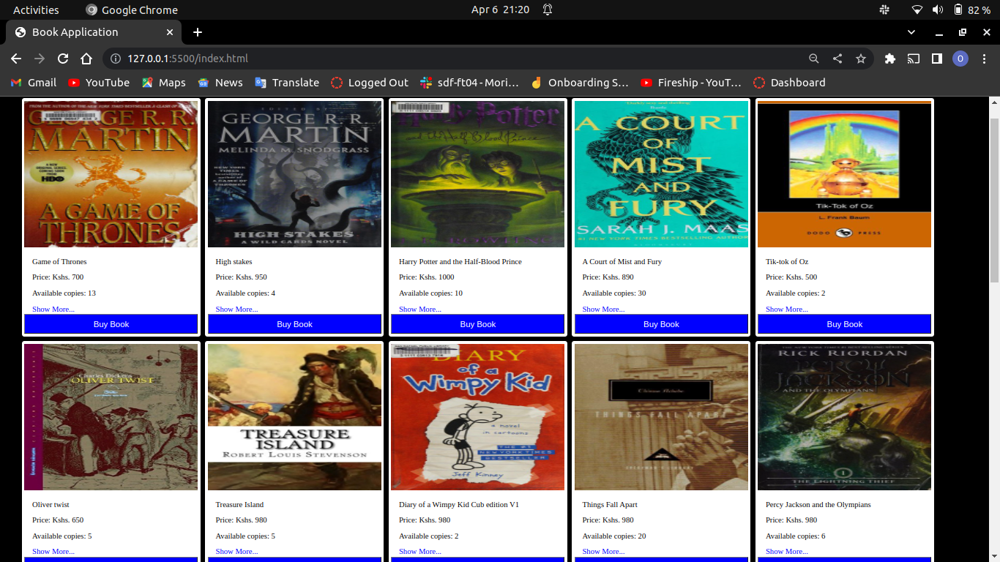
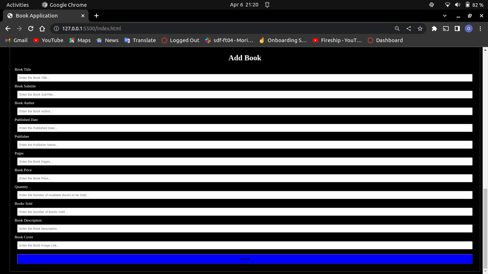

# Book Application #
The Book App is a web application that shows the user a collection of books. The user can view a list of their favorite books along with information about them, such the author, summary, price, and publisher, to mention a few. Also, the user can add their own book to the app and view it listed with all the other books. Also, the user has the option to update their own book by adding or deleting any elements they see fit. Also, if a person doesn't want to see the book, they can delete it. The user may also search for their preferred book by its title, such as Harry Potter.

# Demo #
The pictures as shown depict the outlook of the web app
## Home Page ##

## Add Book ##

# Deployment #
First you have to run the JSON server by running this command on your terminal:
    json-server --watch db.json

Then launch the application in a browser to begin using it.

# Author #
Owen Ngare

# License #
Apache License

